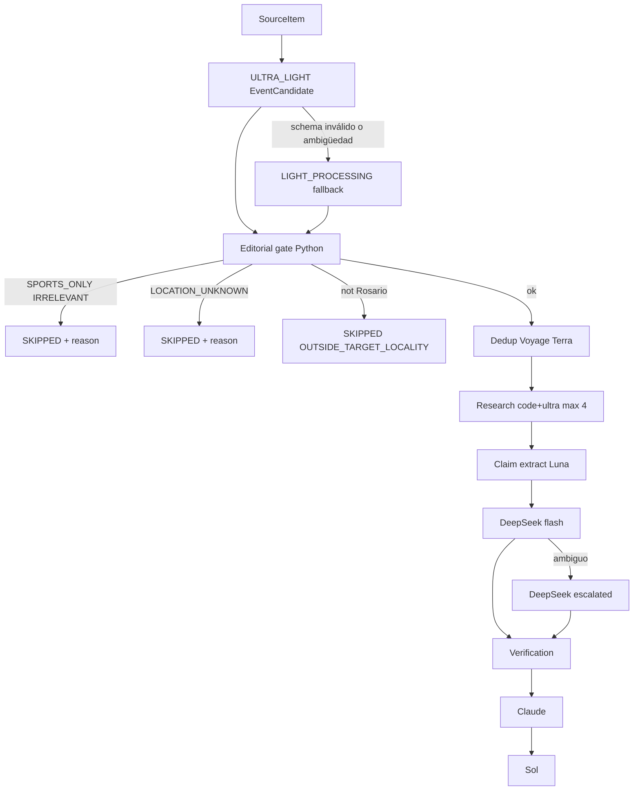

# Optimización de coste + filtros editoriales MVP

## Principios

- Conservar arquitectura (DetectionService → Research → Claims → …).
- Cambios incrementales por capa, cada una con tests.
- Descarte **antes** de embeddings/dedup/create Event/research.
- Una sola llamada de extracción inicial (ultra-light); Luna solo fallback justificado.
- Providers existentes únicamente (OpenAI / DeepSeek / Voyage / Anthropic / SearchProvider).



## Fase 1 — Extender EventCandidate + gate Rosario/deportes

**Schema** [`apps/api/app/schemas/detection.py`](apps/api/app/schemas/detection.py):

- Enum `EditorialScope`: `GENERAL_NEWS | SPORTS_ONLY | SPORTS_PUBLIC_IMPACT | IRRELEVANT`
- Campos nuevos en `EventCandidate`: `editorial_scope`, `editorial_reason`, `location_confidence: float` (0–1)
- Campos de ubicación ya existen

**Prompt** [`apps/api/app/prompts/event_extraction.md`](apps/api/app/prompts/event_extraction.md): pedir scope editorial + ubicación con evidencia; no inventar localidad; deportes solo-fandom vs impacto público (pregunta del brief).

**Gate determinista** (módulo nuevo p.ej. [`apps/api/app/services/editorial_gate.py`](apps/api/app/services/editorial_gate.py)):

1. Si `editorial_scope in {SPORTS_ONLY, IRRELEVANT}` → stop `SPORTS_ONLY` / `IRRELEVANT`
2. Si `SPORTS_PUBLIC_IMPACT` o `GENERAL_NEWS` → seguir a localidad
3. Normalizar país/provincia/localidad (`trim`, `casefold`, quitar acentos opcionales, tolerar `locality` tipo `"rosario, santa fe"`)
4. Target MVP: `AR` + provincia Santa Fe + localidad Rosario
5. Sin localidad usable → `LOCATION_UNKNOWN`
6. Otra localidad clara → `OUTSIDE_TARGET_LOCALITY`

**DetectionService** [`detection_service.py`](apps/api/app/services/detection_service.py):

Después de `_extract_candidate`, **antes** de `_resolve_event` / embeddings:

- Evaluar gate
- Si stop: `SourceItemStatus.SKIPPED` (enum ya existe, hoy no se usa), `PipelineRun` SUCCESS con `metadata_json` `{filter_reason, editorial_scope, locality, ...}`, return `{created: false, filtered: true, reason: ...}`
- Worker: no encolar research si `created` es false (ya es así)

No borrar SourceItem.

**Tests** en `test_detection.py` / `test_editorial_gate.py` con fakes: Colapinto, Newell's, disturbios+heridos Rosario, choque Pellegrini, Córdoba, sin localidad → reasons correctos y sin Event.

## Fase 2 — ULTRA_LIGHT_PROCESSING + fallback Luna

**Config** [`config.py`](apps/api/app/core/config.py) + [`.env.example`](.env.example) + [`docker-compose.yml`](docker-compose.yml):

```env
ULTRA_LIGHT_PROCESSING_PROVIDER=openai
ULTRA_LIGHT_PROCESSING_MODEL=gpt-5-nano
LIGHT_PROCESSING_*  # se mantiene (Luna)
```

**Registry**: `ModelRole.ULTRA_LIGHT_PROCESSING` + mapeo en `get_structured_provider`.

**Extracción**: helper `extract_event_candidate(item)`:

1. Ultra-light `generate_structured`
2. Fallback a `LIGHT_PROCESSING` solo si: ValidationError tras retries del provider; `location_confidence` baja + locality vacía/contradictoria; o reglas explícitas de ambigüedad (documentadas en código)
3. Metadata de run: `fallback_from`, `fallback_to`, `fallback_reason`

**OpenAI adapter** [`openai_provider.py`](apps/api/app/providers/openai_provider.py): si el modelo sugiere nano/gpt-5 y la API acepta parámetros de reasoning mínimo, pasar el effort más bajo disponible; si el SDK rechaza el kwargs, retry sin él (mismo patrón que temperature). No hardcodear el model id en services.

**Claims extraction**: sigue en `LIGHT_PROCESSING` (Luna) — sin cambio de rol.

## Fase 3 — Claim resolution más barato

Env:

```env
CLAIM_RESOLUTION_PROVIDER=deepseek
CLAIM_RESOLUTION_MODEL=deepseek-v4-flash
CLAIM_RESOLUTION_ESCALATED_PROVIDER=deepseek
CLAIM_RESOLUTION_ESCALATED_MODEL=deepseek-chat
```

- Settings + rol o getter `get_claim_resolution_provider(escalated=False|True)`
- Tras resolución flash: escalar **solo** si `confidence` bajo (umbral configurable, default 0.55) o status `UNCERTAIN` con evidencia mixta / `needs_external_verification` ya true y conflicts no vacíos
- Registrar en metadata del run qué claims se escalaron
- No escalar todos por defecto

## Fase 4 — Research barato + SAME_EVENT

**Settings**:

```env
INITIAL_RESEARCH_QUERIES=2
MAX_RESEARCH_QUERIES_PER_EVENT=4
MAX_STANDARD_EVENT_SOURCES=4
MAX_ESCALATED_EVENT_SOURCES=8
```

**Queries** en [`research_service.py`](apps/api/app/services/research_service.py):

1. Construir 1–2 queries por código desde `event_type`, entidades principales, locality, fecha
2. Solo si insuficientes → `ULTRA_LIGHT` para completar hasta INITIAL (2)
3. Queries 3–4 solo en escalación (contradicción / sin primaria / claims inciertos) — reutilizar señales ya disponibles en metadata o heurística simple post-primera pasada

**Attach**:

- Contar fuentes del Event (INITIAL + ADDITIONAL); no pasar `MAX_STANDARD_EVENT_SOURCES` salvo escalación material
- Reemplazar bool `relevant` por clasificación tipada en schema/prompt `research_relevance.md`: `SAME_EVENT | RELATED_CONTEXT | DIFFERENT_EVENT | IRRELEVANT`
- Adjuntar **solo** `SAME_EVENT`
- Ultra-light para relevance; Luna fallback solo si ultra falla schema o confianza ambigua

**Tests**: San Luis → DIFFERENT_EVENT no attach; 4 fuentes coincidentes → stop; contradicción → permite hasta escalated cap.

## Fase 5 — Telemetría

Migración `0011_llm_usage_duration.py`: columna `duration_ms` (nullable int) en `llm_usages`.

- `record_llm_usage(..., duration_ms=...)`
- Medir en OpenAI/Anthropic/Voyage alrededor del call (`perf_counter`)
- Seguir omitiendo tokens inventados; sí registrar duration aunque tokens sean 0 si hubo response usage vacío (ajustar early-return: registrar si duration o tokens > 0)
- Verificar `usage_scope` en writing rewrite + cada audit (ya dentro del loop de AuditService; asegurar bind de model_role en cada rewrite/audit)

Search (Exa/Brave): fuera del alcance de “tokens LLM”; no inventar tokens. Opcional mínimo: no bloquear este PR.

## Orden de implementación sugerido

1. Gate + schema + prompt + tests filtro (mayor ahorro / menos ruido)
2. Ultra-light + fallback + env
3. Research caps + SAME_EVENT
4. Claim resolution flash + escalate
5. duration_ms migration + provider timing

## Archivos principales a tocar

- [`schemas/detection.py`](apps/api/app/schemas/detection.py), [`schemas/research.py`](apps/api/app/schemas/research.py)
- [`prompts/event_extraction.md`](apps/api/app/prompts/event_extraction.md), [`prompts/research_relevance.md`](apps/api/app/prompts/research_relevance.md), [`prompts/research_queries.md`](apps/api/app/prompts/research_queries.md)
- [`detection_service.py`](apps/api/app/services/detection_service.py), nuevo `editorial_gate.py`
- [`research_service.py`](apps/api/app/services/research_service.py), [`claim_service.py`](apps/api/app/services/claim_service.py)
- [`registry.py`](apps/api/app/providers/registry.py), [`openai_provider.py`](apps/api/app/providers/openai_provider.py), [`config.py`](apps/api/app/core/config.py)
- [`usage_recorder.py`](apps/api/app/services/usage_recorder.py), [`models/llm_usage.py`](apps/api/app/models/llm_usage.py), migration
- `.env.example`, `docker-compose.yml`
- Tests: `test_editorial_gate.py`, ampliar `test_detection.py`, `test_research.py`, `test_claims.py`, `test_llm_usage.py`

## Qué se abarata / elimina

| Antes | Después |
|-------|---------|
| Luna en toda EventCandidate extraction | GPT-5 nano (ultra); Luna solo fallback |
| Research: LLM siempre genera hasta 4 queries | Código + ultra; 2 iniciales |
| Research: adjuntar todas las relevant | Cap 4 (8 si escala); solo SAME_EVENT |
| Relevance bool LIGHT | Clasificación tipada ULTRA (+ Luna fallback) |
| Claim resolution modelo “caro” fijo | DeepSeek flash; escalado selectivo |
| Claim extraction | **Sin abaratar** (sigue Luna) |
| Dedup embeddings / Terra / Claude / Sol | Sin cambio de rol en esta tanda |

## Fuera de alcance (esta tanda)

- Geocoding externo
- Nuevos vendors/API keys
- Abaratar claim extraction
- Costos USD
- Filtrar deportes/ubicación con LLM aparte
