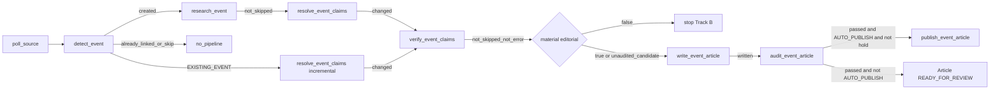

# Pipeline conectado

Circuito real en [`apps/api/app/workers/tasks.py`](../../apps/api/app/workers/tasks.py). Rutas de cola en el mismo archivo; Beat: `poll_monitored_sources` cada `monitored_source_poll_interval_seconds` (default 300) si Admin tiene `auto_poll_enabled` (default activo). Cada `poll_source` inspecciona como máximo `monitored_source_poll_limit` entradas recientes (default 5) antes de descargar HTML. Admin re-encola stages con trigger `"admin"` (`api/admin.py`). Casos de lectores y `EditorialService` **no** están en este circuito.

## Etapas

| Task | Cola | Servicio | Siguiente |
| --- | --- | --- | --- |
| `poll_source` | `ingestion` | `IngestionService.poll_source` | `detect_event` por item (cap `max_new_events_per_poll` vía `_item_ids_for_detection`) |
| `detect_event` | `event_detection` | `DetectionService.detect` | `research_event` si `created`; `resolve_event_claims(event_id, existing_event, source_item_id)` si link nuevo; nada si `already_linked`/filtro/fallo |
| `research_event` | `research` | `ResearchService.research` | `resolve_event_claims` si no `skipped` |
| `resolve_event_claims` | `claim_resolution` | `ClaimService.resolve` | `verify_event_claims` si no `skipped` y `changed` (o `persisted` None/>0 en Track A) |
| `verify_event_claims` | `verification` | `VerificationService.verify` | `write_event_article` si no `skipped`, no `error`, y `should_enqueue_write` |
| `write_event_article` | `writing` | `WritingService.write` | `audit_event_article` si `written is True` (incluye `unaudited_candidate`) |
| `audit_event_article` | `auditing` | `AuditService.audit` | `publish_event_article` si passed, no hold, y `AUTO_PUBLISH=true` |
| `publish_event_article` | `publishing` | `PublishService.publish` | — |

Cap de poll: si `allow_new_event_pipeline` falla, `detect_event` persiste un `PipelineRun` de detección con `reason=max_new_events_per_poll` (sin LLM) y retorna skip. Si no crea y `fill_quota`, libera el slot y prueba otro PENDING (`_enqueue_next_for_quota`).

Admin: listado **Publicaciones** (`GET /api/v1/admin/publications`) = estado actual por última detección; `GET /detection-runs` y `stats.detection_24h` cuentan ejecuciones del período (intentos vs fuentes únicas). **Estadísticas** (`GET /api/v1/admin/analytics`) es solo lectura (embudo, descarte editorial, Track B, etiquetas). Costos estimados: `GET /costs` y `stats.costs_24h` (subtotal conocido + cobertura; atribución 1:1). Detalle de suceso: costo directo, sin backfill de embeddings ajenos. `no_material_change` solo en Event/write.

GET público de artículo: `compact_public_claims(..., freeze_to_version=published_version)` recupera el snapshot con `list_snapshot_binding_runs` (solo writing/auditing cuyo JSONB apunta a esa versión; sin tope de recencia) y `evidence_snapshot_for_version`. No usa `list_for_event(limit=50)`. Snapshot ausente → fallback neutral, no Verification live. Tests: `test_public_api.py` (`test_public_article_keeps_v1_snapshot_after_later_runs_fill_the_50_cap`).

Trazabilidad por versión (C11, lectura): `GET /api/v1/admin/articles/{article_id}/trace` (sin `version` = `published_version`; si no hay publicada → 409 `not_published`) y `GET /api/v1/admin/articles/{article_id}/versions/{version_number}/trace`. `article_version` = `ArticleVersion.version_number`; `article_version_id` = UUID de esa fila. La cadena sale del snapshot atado a esa versión (`evidence_snapshot_for_version` / `list_lineage_runs`), no de `current_version`, ni de la última corrida del evento, ni de un fingerprint coincidente. `writing_run_id` queda en metadata de Writing al persistir la versión (`produced_this_version`); un rewrite de Audit o un `revise` editorial no inventa un productor (`context_only` / `not_recorded`). `contract_version` es el del snapshot; `export_schema` es `article-version-trace-1`. No vuelca `metadata_json` ni entra al GET público. Tests: `test_version_traceability.py`.

## Create, link, skip (detección)

En `DetectionService._resolve_event` / `detect`: URL conocida → attach; match embeddings (auto-merge ≥ HIGH) o DeepSeek si el par es ambiguo → link o create; gate → `SKIPPED`. Create: `EventService.create` + `INITIAL`. Un `EventSource` ya existente (`already_linked`) marca el item `PROCESSED` y no reabre pipeline. Un link **nuevo** encola claims incremental (`existing_event`) **sin** research. El create encola research (Track A).

Admin puede disparar research/claims/… sobre un Event ya existente.

## Track B (EXISTING_EVENT)

Fuente nueva vinculada → extrae Claims **solo** de esa SourceItem (prompt `identity_only`: identidad del suceso, sin `title_internal` ni cifras históricas; una magnitud de 4+ dígitos debe estar en el snippet/cuerpo o se descarta el excerpt), merge por `assertion_key`, re-resuelve claims tocados y hermanos de `comparison_key`. Verification sigue las reglas actuales (búsquedas dirigidas si hace falta) y **no** convierte un search hit en `EventSource` salvo juicio SUPPORTS/CONTRADICTS/QUALIFIES **sin** jurisdicción distinta a la del suceso; no se relanza research web completo. `MaterialChangeDetector` decide **antes** de Writing: corroboración `SINGLE_SOURCE→SUPPORTED` / `evidence_posture_changed` / `proposition_corroborated` **no** es material editorial. Un claim nuevo de la misma proposición (p. ej. misma fecha o mismo `comparison_key`) no dispara `new_high_claim`. Si no hay cambio editorial: no LLM de Writing, no Audit, no ArticleVersion, no EventUpdate público. Si hay: Writing usa `published_version` live + `knowledge_delta` + claims autoritativos (sin `source_contexts`). Audit valida la candidata contra el snapshot de **esa** versión. `Event.status` permanece `PUBLISHED`; `published_version` sigue en V1 hasta publish. Con `AUTO_PUBLISH=true`, Audit passed encola publish de V2; con `false`, `Article.status` queda `READY_FOR_REVIEW`. Retry de Writing con candidata no auditada (`unaudited_candidate`) reencola Audit sin crear V3. La API pública congela status/labels de Claims según el snapshot de la versión live.

## Audit

`AuditService` opera sobre el **snapshot de evidencia de la versión** (`evidence_snapshot_for_version`: run de auditing de esa `version_after`, o writing SUCCESS con `version` igual). No reconstruye `ArticleContext` con claims/verify actuales ni completa un snapshot incompleto con el par vigente. El LLM de Sol recibe solo titular, bajada, cuerpo, ids de bloque y reglas breves de neutralidad; no claims, Verification ni cobertura. Invariantes estructurales (`audit_policy.structural_findings`: contrato ausente/desparejado, `coverage_gap` / `expected_central.match != equivalent`, `central_unverified` / `verification_incomplete` de centrales, `claim_ids` ajenos al snapshot, y C5 `surface_validation_findings` sobre titular/bajada/lead vs `public_rendering` de ese snapshot) se fusionan en código (`merge_audit_result`); un auditor de lenguaje optimista no las silencia. Hallazgo estructural de contrato/cobertura/centrales **o** incumplimiento C5 HIGH **no** dispara rewrite (`structural_block`); el texto generado se conserva. Issues lingüísticos HIGH/MEDIUM sí, hasta `max_audit_rewrite_cycles` (cap 2 → peor caso 3 auditorías + 2 rewrites). Tras rewrite se reata el mismo snapshot a vN+1 y se re-audita; el `passed` de vN no vale. `EditorialService.revise` no entra a este loop. Un 429 temporal de OpenAI (`rate_limit_exceeded`) se espera y reintenta en el cliente (`providers/rate_limit.py`, SDK `max_retries=0`, tope `JOB_MAX_RETRIES`); no es rechazo editorial. Agotar o `insufficient_quota` deja el run `FAILED` y no publica.

## Publish

`PublishService`: no archived; `already_published` si `published_version == current_version`; hold bloquea salvo `override_editorial_hold` en admin. El gate usa `latest_completed` de auditing (SUCCESS o FAILED) y exige `audited`, `passed`, `version_after == current_version` **al publicar**, snapshot de esa versión, e invariantes estructurales en verde. Un FAILED posterior a un SUCCESS de la misma versión no aprueba. El worker encola publish si Audit `passed`, no hold y `AUTO_PUBLISH=true` (V1 y actualizaciones). Si `AUTO_PUBLISH=false`, Audit passed deja `READY_FOR_REVIEW`. `revise` humano no pasa por este helper. Tras un publish/revise **committed**, `HeroImageService` intenta una portada determinista en otra sesión; el fallo no deshace el live. Feed/live/search/nearby y el detalle público incluyen `hero_image_url`; si falta, el GET intenta generarla sin bloquear la respuesta.

## Invariantes (con evidencia en schema/servicios)

- Un `RUNNING` por stage (índices parciales únicos; IntegrityError → `already_running`). Writing/auditing/publishing comparten un lock (`pipeline_lock.py`, migración `0009`).
- Un `Article` por evento; `ArticleVersion` por número; write material sobre publicado deja `DRAFT` y conserva `published_version` live.
- Ingesta: identidad `external_id` o `canonical_url` por fuente; contenido nuevo → `PENDING` otra vez (`SourceItemService.ingest`).
- Claims: unique `claim_id`+`source_item_id` en evidencia; merge por `assertion_key`.
- Contrato `editorial-evidence-1` (`schemas/editorial_evidence.py`) en `pipeline_runs.metadata_json` (sin migración 0015): `claim_resolution` SUCCESS guarda `claims_fingerprint` + `coverage` (expected_central, drop-log, `coverage_gap`); `verification` SUCCESS guarda `based_on_claim_run_id` + el mismo fingerprint + `evaluated_claims` / `decision_by_claim_id` / `verification_budget`. `ClaimDecision.evaluation_state` es JSON opcional (`complete`/`skipped`; `pending`/`failed` existen en el enum y no se escriben en SUCCESS). Ausencia del campo al leer = unknown/legacy, no `complete`. El assessment barato persiste el juicio crudo en `assessments[]`; `assessment_has_support` y el status barato usan solo lo que `_admit_relation` dejó en `comparison_checks` como `SUPPORTS`. `DOES_NOT_ESTABLISH` queda en metadata, no como `ClaimEvidence`/`EventSource`. `CONFLICTING` de resolución o Verification solo queda si `conflict_comparability` acredita la misma proposición (sujeto, predicado, período/instante, unidad/base cuantitativa, ámbito cuando está); un `CONTRADICTS` crudo o un bucket compartido no basta. Un claim mixto (acto + vigencia/alcance, acto + reacción coordinada, o atributo + acto) no recibe `authentic_primary` sobre el compuesto; el split copia evidencia por componente. Writing **captura** el par + `ArticleContext` **antes** del LLM (`capture_evidence_snapshot`) y lo persiste atado a `article.current_version`; el prompt compacta solo decisiones completas/legacy. Labels, `is_strong_verification` y el lock de resolve usan `compatible_verification_pair` / `verification_view_for_event` (estado live del Event). El GET público (`article_payload` → `compact_public_claims(..., freeze_to_version=published_version)`) deriva status, DTO de presentación, etiquetas, resolución C3 y `public_rendering` (C4) del `evidence_snapshot` de esa versión (`view_from_evidence_snapshot`); no rellena huecos con Verification live. `reason_code` se mapea en código desde Demotion / gates de contradicción / procedencia; `final_reason` se renderiza desde el código. `verified_scope` del texto entero exige `SUPPORTS` persistido; un status `SINGLE_SOURCE` no lo sustituye. `public_rendering` es un contrato de permisos puro; ausencia o evaluación no completa → `None`. Snapshot legacy sin C3/C4: campos `None`, sin fortalecer status ni inventar permisos. Writing compacta sin esos campos. Admin/analytics siguen en el par live. Extract SUCCESS nueva + verify FAILED o ausente: no hay contrato de verify vigente; Audit/publish no lo sustituyen por un verify viejo. El DTO público proyecta copy C9 desde ese snapshot (`presentation_kind`, etiqueta, explicación, limitación, detalles); no re-corre `assess_origins`, no envía `llm_reason` ni `demotion` técnico, y un claim no evaluado no se presenta como independencia evaluada. Admin serializa `demotion` con `include_internal`. El artículo público (`ArticleBody`) muestra esos textos en popover o sheet; no recalcula copy ni consulta Verification al abrir.
- Cobertura central: proposiciones esperadas desde título/lead con acto reportable, incluyendo la declaración de quien dicta si aparece aparte de la resolución; recovery reintenta dropped equivalentes con `_valid_evidence` contra el cuerpo (no el título como confirmación del mundo) y puede sustituir un excerpt inválido por un fragmento literal del cuerpo (`salvage_excerpt`). Verify prioriza match de `expected_central` y no lo veta como mundano. `coverage_gap` / `central_unverified` obligatorio en el snapshot de la versión **bloquean** audit y publish (código, no heurística de título). Un secundario diferido no usado no bloquea. `SINGLE_SOURCE` evaluado no es `central_unverified`.
- Issues de Sol en `pipeline_runs.metadata_json` (con `reason` / `action` opcionales). `Correction` sale de `EditorialService.revise`, no del audit autónomo.
- `editorial_hold` impide el enqueue de publish desde `audit_event_article` (cableado actual; el override no limpia el flag — STATE).
