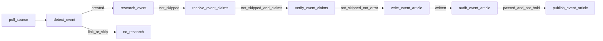

# Pipeline conectado

Circuito real en [`apps/api/app/workers/tasks.py`](../../apps/api/app/workers/tasks.py). Rutas de cola en el mismo archivo; Beat: `poll_monitored_sources` cada `ingestion_poll_interval_seconds`. Admin re-encola stages con trigger `"admin"` (`api/admin.py`). Casos de lectores y `EditorialService` **no** están en este circuito.

## Etapas

| Task | Cola | Servicio | Siguiente |
| --- | --- | --- | --- |
| `poll_source` | `ingestion` | `IngestionService.poll_source` | `detect_event` por item (cap `max_new_events_per_poll` vía `_item_ids_for_detection`) |
| `detect_event` | `event_detection` | `DetectionService.detect` | `research_event` solo si `created` y `event_id` |
| `research_event` | `research` | `ResearchService.research` | `resolve_event_claims` si no `skipped` |
| `resolve_event_claims` | `claim_resolution` | `ClaimService.resolve` | `verify_event_claims` si no `skipped` y (`persisted` es `None` o `> 0`) |
| `verify_event_claims` | `verification` | `VerificationService.verify` | `write_event_article` si no `skipped` y no `error` |
| `write_event_article` | `writing` | `WritingService.write` | `audit_event_article` si `written is True` |
| `audit_event_article` | `auditing` | `AuditService.audit` | `publish_event_article` si no `skipped`, `passed is True`, y el artículo no tiene `editorial_hold` |
| `publish_event_article` | `publishing` | `PublishService.publish` | — |

Cap de poll: si `allow_new_event_pipeline` falla, `detect_event` persiste un `PipelineRun` de detección con `reason=max_new_events_per_poll` (sin LLM) y retorna skip. Si no crea y `fill_quota`, libera el slot y prueba otro PENDING (`_enqueue_next_for_quota`).

Admin: listado **Publicaciones** (`GET /api/v1/admin/publications`) = estado actual por última detección; `GET /detection-runs` y `stats.detection_24h` cuentan ejecuciones del período (intentos vs fuentes únicas). Costos estimados: `GET /costs` y `stats.costs_24h` (subtotal conocido + cobertura; atribución 1:1). Detalle de suceso: costo directo, sin backfill de embeddings ajenos. `no_material_change` solo en Event/write.

## Create, link, skip (detección)

En `DetectionService._resolve_event` / `detect`: URL conocida → attach; match código/embeddings/Terra → link o create; gate (`evaluate_editorial_gate`, prefiltro deportes) → `SKIPPED`. Create: `EventService.create` + `INITIAL`. **Hoy** solo el create encola research; link/skip no. Eso es cableado, no política documentada a preservar (ver STATE).

Admin puede disparar research/claims/… sobre un Event ya existente; el poll autónomo no reabre esa cadena al vincular un item nuevo.

## Audit

`AuditService` opera sobre el **snapshot de evidencia de la versión** (`evidence_snapshot_for_version`: run de auditing de esa `version_after`, o writing SUCCESS con `version` igual). No reconstruye `ArticleContext` con claims/verify actuales ni completa un snapshot incompleto con el par vigente. Invariantes estructurales (`audit_policy.structural_findings`: contrato ausente/desparejado, `coverage_gap` / `expected_central.match != equivalent`, `central_unverified` / `verification_incomplete` de centrales, `claim_ids` ajenos al snapshot) se fusionan con el LLM (`merge_audit_result`); un auditor optimista no las silencia. Hallazgo estructural de contrato/cobertura/centrales **no** dispara rewrite (`structural_block`). Issues semánticos HIGH/MEDIUM sí, hasta `max_audit_rewrite_cycles` (cap 2 → peor caso 3 auditorías + 2 rewrites). Tras rewrite se reata el mismo snapshot a vN+1 y se re-audita; el `passed` de vN no vale. `EditorialService.revise` no entra a este loop.

## Publish

`PublishService`: no archived; `already_published` si `published_version == current_version`; hold bloquea salvo `override_editorial_hold` en admin. El gate usa `latest_completed` de auditing (SUCCESS o FAILED) y exige `audited`, `passed`, `version_after == current_version` **al publicar**, snapshot de esa versión, e invariantes estructurales en verde. Un FAILED posterior a un SUCCESS de la misma versión no aprueba. El worker **no lee** `AUTO_PUBLISH`. Ningún stage asigna `READY_FOR_REVIEW`. `revise` humano no pasa por este helper; un write autónomo posterior sí.

## Invariantes (con evidencia en schema/servicios)

- Un `RUNNING` por stage (índices parciales únicos; IntegrityError → `already_running`). Writing/auditing/publishing comparten un lock (`pipeline_lock.py`, migración `0009`).
- Un `Article` por evento; `ArticleVersion` por número; write material sobre publicado deja `DRAFT` y conserva `published_version` live.
- Ingesta: identidad `external_id` o `canonical_url` por fuente; contenido nuevo → `PENDING` otra vez (`SourceItemService.ingest`).
- Claims: unique `claim_id`+`source_item_id` en evidencia; merge por `assertion_key`.
- Contrato `editorial-evidence-1` (`schemas/editorial_evidence.py`) en `pipeline_runs.metadata_json` (sin migración 0015): `claim_resolution` SUCCESS guarda `claims_fingerprint` + `coverage` (expected_central, drop-log, `coverage_gap`); `verification` SUCCESS guarda `based_on_claim_run_id` + el mismo fingerprint + `evaluated_claims` / `decision_by_claim_id` / `verification_budget`. Writing **captura** el par + `ArticleContext` **antes** del LLM (`capture_evidence_snapshot`) y lo persiste atado a `article.current_version`. Labels, `is_strong_verification`, `compact_verification` y el lock de resolve usan `compatible_verification_pair` / `verification_view_for_event`, no `latest_success_verification` suelto. Extract SUCCESS nueva + verify FAILED o ausente: no hay contrato de verify vigente; Audit/publish no lo sustituyen por un verify viejo.
- Cobertura central: proposiciones esperadas desde título/lead con acto reportable; recovery reintenta dropped equivalentes con `_valid_evidence` contra el cuerpo (no el título como confirmación del mundo). Verify prioriza match de `expected_central` y no lo veta como mundano. `coverage_gap` / `central_unverified` obligatorio en el snapshot de la versión **bloquean** audit y publish (código, no heurística de título). Un secundario diferido no usado no bloquea. `SINGLE_SOURCE` evaluado no es `central_unverified`.
- Issues de Sol en `pipeline_runs.metadata_json` (con `reason` / `action` opcionales). `Correction` sale de `EditorialService.revise`, no del audit autónomo.
- `editorial_hold` impide el enqueue de publish desde `audit_event_article` (cableado actual; el override no limpia el flag — STATE).
